

&nbsp;
&nbsp;

## Lo que construyo

  <a href="https://www.lebbo.es">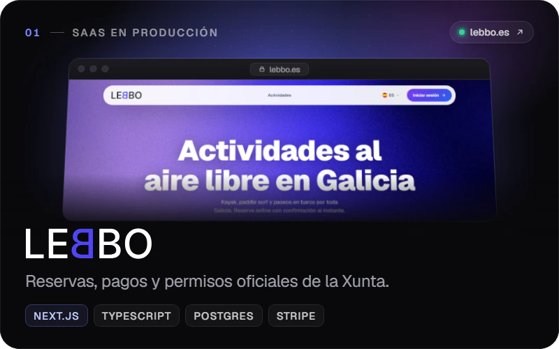</a>
  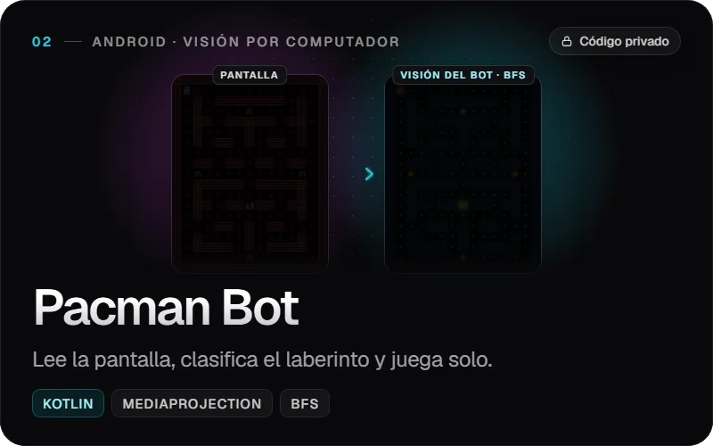

  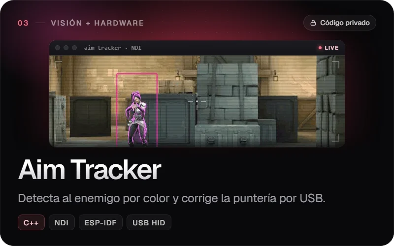
  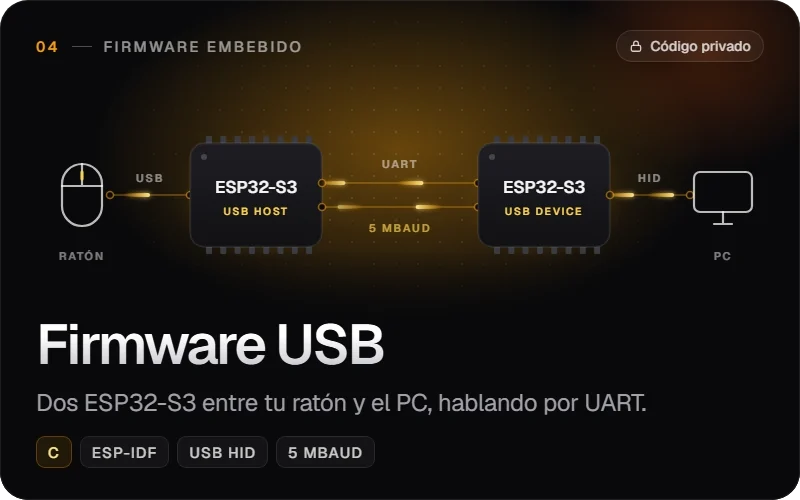

## Con qué

  <a href="https://nextjs.org" title="Next.js">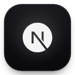</a>
  <a href="https://react.dev" title="React">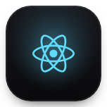</a>
  <a href="https://www.typescriptlang.org" title="TypeScript">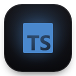</a>
  
  <a href="https://nodejs.org" title="Node.js">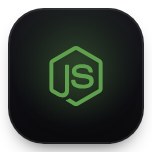</a>
  
  
  <a href="https://www.mysql.com" title="MySQL">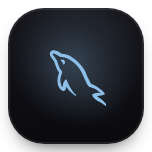</a>
  
   
  <a href="https://www.python.org" title="Python">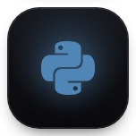</a>
  
  
  <a href="https://developer.android.com/studio" title="Android Studio">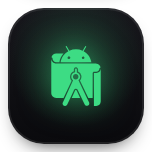</a>
  <a href="https://dev.java" title="Java">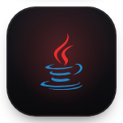</a>
  
  <a href="https://isocpp.org" title="C++">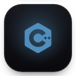</a>
  
  
   
  <a href="https://vercel.com" title="Vercel">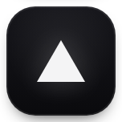</a>
  <a href="https://www.portainer.io" title="Portainer">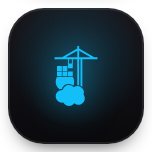</a>
  <a href="https://coolify.io" title="Coolify">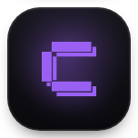</a>
  
  <a href="https://git-scm.com" title="Git">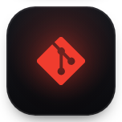</a>
  
  
  
  

## Estudios

  &nbsp;
  

## Certificaciones

  &nbsp;
  &nbsp;
  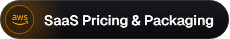

 

  <picture>
    <source media="(prefers-color-scheme: dark)" srcset="https://raw.githubusercontent.com/DavidTorresRial/DavidTorresRial/output/snake-dark.svg">
    
  </picture>

